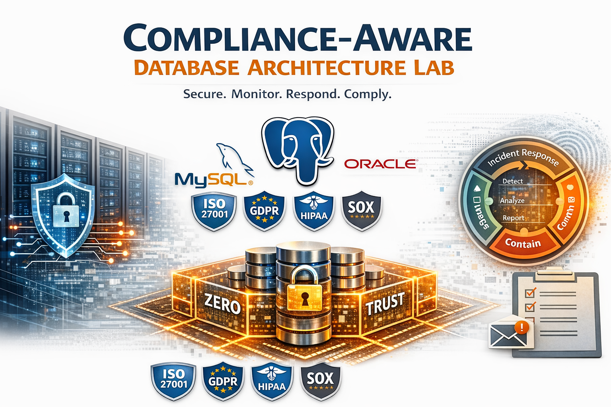

# 🛡️ Compliance-Aware Database Architecture Lab

> Production-grade PostgreSQL governance lab with MySQL and Oracle control variants.

## 🎯 Project Objective

This repository demonstrates a **compliance-aware PostgreSQL architecture** designed for audit readiness.\
It integrates security, governance, monitoring, high availability, disaster recovery, and regulatory escalation into a single structured platform.

PostgreSQL is the primary operational engine.\
MySQL and Oracle variants demonstrate cross-engine control equivalency.

  

